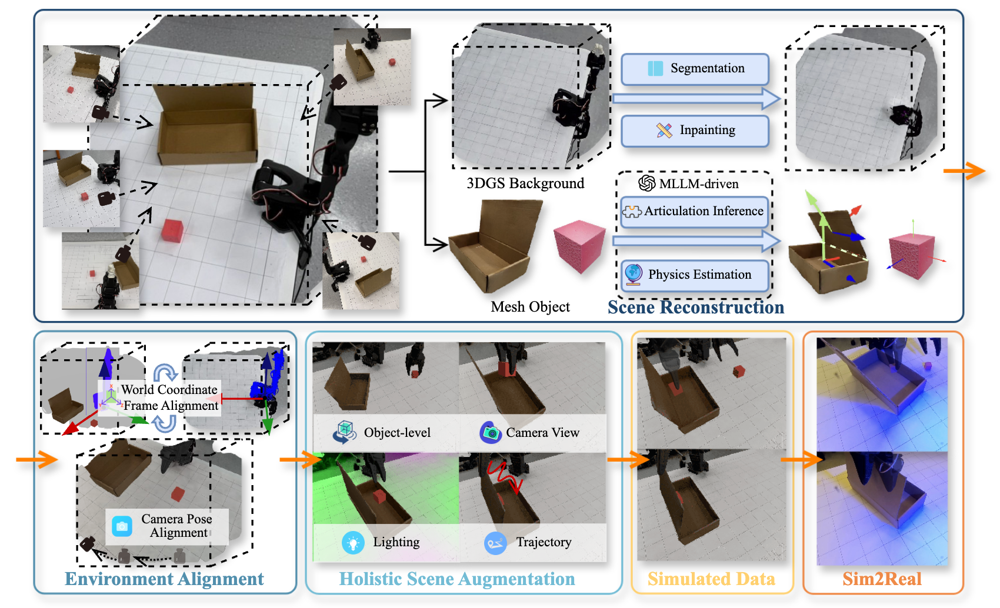

<h1 align="center"> High-Fidelity Simulated Data Generation for Real-World 

Zero-Shot Robotic Manipulation Learning 

with Gaussian Splatting </h1>

<div align="center">

[[Website]](https://robosimgs.github.io/)
[[Arxiv]]()
[[Video]](https://www.youtube.com/watch?v=nvUXAovzc6Q)

[](https://ubuntu.com/blog/tag/22-04-lts) []()


</div>


## Abstract
The scalability of robotic learning is fundamentally bottlenecked by the significant cost and labor of real-world data collection. While simulated data offers a scalable alternative, it often fails to generalize to the real world due to significant gaps in visual appearance, physical properties, and object interactions. To address this, we propose RoboSimGS, a novel Real2Sim2Real framework that converts multi-view real-world images into scalable, high-fidelity, and physically interactive simulation environments for robotic manipulation. Our approach reconstructs scenes using a hybrid representation: 3D Gaussian Splatting (3DGS) captures the photorealistic appearance of the environment, while mesh primitives for interactive objects ensure accurate physics simulation. Crucially, we pioneer the use of a Multi-modal Large Language Model (MLLM) to automate the creation of physically plausible, articulated assets. The MLLM analyzes visual data to infer not only physical properties (e.g., density, stiffness) but also complex kinematic structures (e.g., hinges, sliding rails) of objects. We demonstrate that policies trained entirely on data generated by RoboSimGS achieve successful zero-shot sim-to-real transfer across a diverse set of real-world manipulation tasks. Furthermore, data from RoboSimGS significantly enhances the performance and generalization capabilities of SOTA methods. Our results validate RoboSimGS as a powerful and scalable solution for bridging the sim-to-real gap.




## TODO
- [] Release 3D reconstruction pipeline
- [] Release MLLM-based Articulation Inference and Physics Estimation
- [] Release simulated data generation pipeline
- [] Release codebase for training Diffusion Policy on our simulated data


# Citation
If you find our work useful, please consider citing us!

```bibtex
@article{he2025asap,
  title={High-Fidelity Simulated Data Generation for Real-World Zero-Shot Robotic Manipulation Learning with Gaussian Splatting},
  author={},
  journal={},
  year={2025}
}
```

# License

This project is licensed under the MIT License - see the [LICENSE](LICENSE) file for details.
