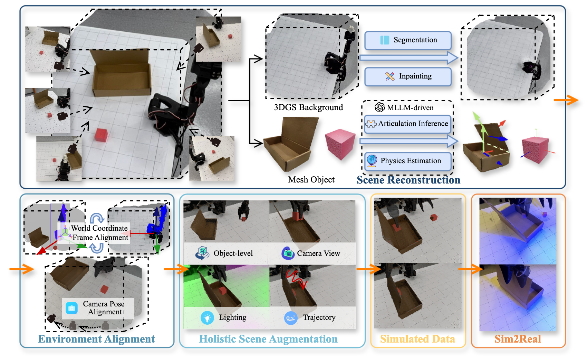

<h1 align="center"> High-Fidelity Simulated Data Generation for Real-World 

Zero-Shot Robotic Manipulation Learning 

with Gaussian Splatting </h1>

<div align="center">

[[Website]](https://robosimgs.github.io/)
[[Arxiv]]()
[[Video]](https://www.youtube.com/watch?v=nvUXAovzc6Q)

[](https://ubuntu.com/blog/tag/22-04-lts) []()


</div>

## Pipeline

<div align="center">

</div>

## TODO
- [✅] Release arXiv technique report
- [✅] Release 3D reconstruction pipeline
- [✅] Release MLLM-based Articulation Inference and Physics Estimation
- [✅] Release code for World Coordinate Frame Alignment
- [✅] Release simulated data generation pipeline
- [ ] Release code for Camera Pose Alignment

## 📚 Table of Contents

1. **[Overview](#overview)**  
   - Links: [Website](https://robosimgs.github.io/) • [Arxiv]() • [Video](https://www.youtube.com/watch?v=nvUXAovzc6Q)
 

2. **[Installation & Setup](#installation)**  


3. **[Scene Reconstruction](#scene-reconstruction)**  
    3.1 [Background Reconstruction](#background-reconstruction)
    
    3.2 [Object Reconstruction](#object-reconstruction)

   - 3.2.1 [Articulation Inference](Articulation/Articulation.md)

   - 3.2.2 [Physics Estimation](Articulation/Articulation.md)


4. **[Simulated Data Generation](#simulated-data-generation)**  
   4.1 [World Coordinate Frame Alignment](#world-coordinate-frame-alignment)  
   4.2 [Camera Pose Alignment](#camera-pose-alignment)  
   4.3 [Data Generation](#data-generation)  
   4.4 [Holistic Scene Augmentation](#holistic-scene-augmentation)


5. **[Policy Training](#policy-training)**  

6. **[Sim2Real Deployment](#sim2real-deployment)**  

7. **[Citation](#citation)**  

8. **[License](#license)**


# Installation

RoboSimGS codebase is built on top of [Genesis](https://github.com/Genesis-Embodied-AI/Genesis) and [Lerobot](https://github.com/huggingface/lerobot).  We are actively working on this section and will update it soon. 🚧


# Scene Reconstruction
## Background Reconstruction
We reconstruct a 3D background scene using the 3D Gaussian Splatting (3DGS) method within the [Nerfstudio](https://github.com/nerfstudio-project/nerfstudio). For more in-depth information, always refer to the official Nerfstudio GitHub repository. To achieve World Coordinate Frame Alignment, it is essential to segment the robot arm from the background. We accomplish this by reconstructing the 3D scene using the [Feature Splatting](https://github.com/vuer-ai/feature-splatting) method provided by [Nerfstudio](https://github.com/nerfstudio-project/nerfstudio). 

The final output of this process will be a .ply file representing the 3D Gaussian Splatting scene, which can be viewed in compatible real-time renderers.


## Object Reconstruction
As mentioned in our paper, the object reconstruction is performed using the 'AR Code' app on an iPhone 16 Pro. By scanning the object with the phone, we can obtain a high-quality mesh.

**MLLM-driven Articulation Inference**. A comprehensive overview of the architecture is available in the [Document](Articulation/Articulation.md).

**MLLM-driven Physics Estimation**. A comprehensive overview of the architecture is available in the [Document](Articulation/Articulation.md).

# Simulated Data Generation

```bash
conda create --name robosimgs python=3.10 -y
conda activate robosimgs
pip install -r requirements.txt
```

## World Coordinate Frame Alignment
The core of our World Coordinate Frame Alignment procedure is the registration of two geometric representations of the robot arm. First, we generate the ground-truth point cloud of the robot arm directly from the simulation environment and save it to the specified path: sim_robot_path.

Second, during the [Background Reconstruction](#background-reconstruction) process, the 3D Gaussian Splatting (3DGS) representation of the arm is segmented from the real-world scene. This segmented model is then stored at: real_robot_path.


These two files provide the source and target geometries for the subsequent alignment algorithm. A key challenge in this process is the scale mismatch between the simulated point cloud. Since the standard ICP algorithm does not inherently solve for scale, a direct registration would fail. To address this,  we employ a human-in-the-loop approach. A user interactively adjusts the scale of the reconstructed model, using a real-time visualization window to visually assess the alignment quality.


```bash
conda activate robosimgs
cd utils
python icp.py --lerobot_real real_robot_path --lerobot_sim sim_robot_path --size 0.7
```

## Camera Pose Alignment
We are actively working on this section and will update it soon. 🚧

## Data Generation
We provide an example of a pre-aligned 3DGS, which is ready for direct use in data generation. You can download it from our [Hugging Face](https://huggingface.co/datasets/haoyu1234/robosimgs).

```bash
conda activate robosimgs
cd DataGeneration
python pick_banana.py --start 0 --num_steps 5 --use_gs True --data_augmentation True --save_dir collected_data --reset_cam 0.001 --single_view False
```

We will provide an example of collected data, which is ready for direct use in policy training.

## Holistic Scene Augmentation
To enhance the diversity and robustness of our training data, we have integrated data augmentation directly into our data collection pipeline.

# Policy Training
We utilize codebase from [IDP3](https://github.com/YanjieZe/Improved-3D-Diffusion-Policy) for policy training.

# Sim2Real Deployment
We utilize the [lerobot](https://github.com/huggingface/lerobot) for our Sim2Real deployment.


# Citation
If you find our work useful, please consider citing us!

```bibtex
@article{zhao2025high,
  title={High-Fidelity Simulated Data Generation for Real-World Zero-Shot Robotic Manipulation Learning with Gaussian Splatting},
  author={Zhao, Haoyu and Zeng, Cheng and Zhuang, Linghao and Zhao, Yaxi and Xue, Shengke and Wang, Hao and Zhao, Xingyue and Li, Zhongyu and Li, Kehan and Huang, Siteng and others},
  journal={arXiv preprint arXiv:2510.10637},
  year={2025}
}
```

# License

This project is licensed under the MIT License - see the [LICENSE](LICENSE) file for details.
